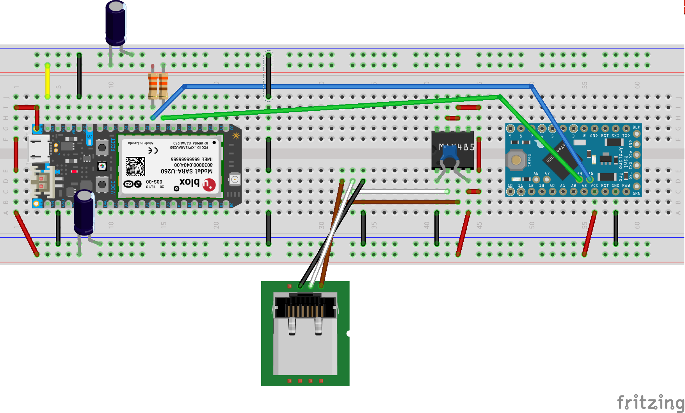
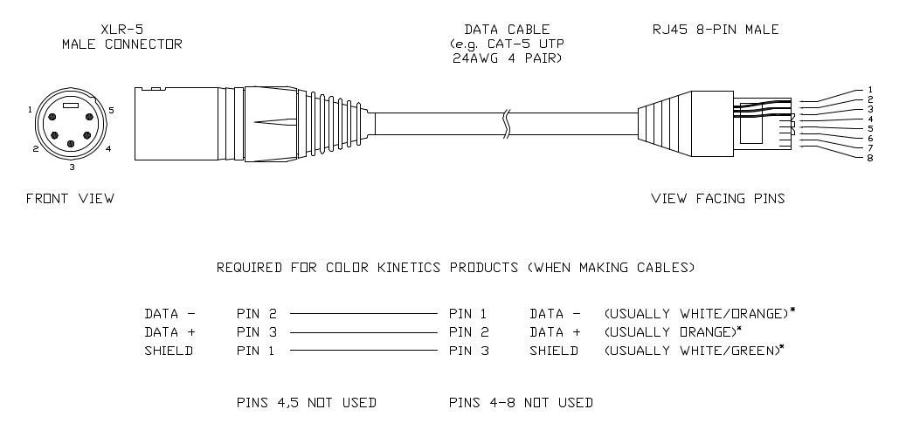
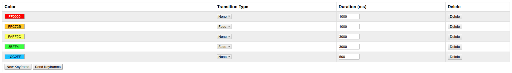

# Atlas Tower Light Controller

## Overview
This is an Internet connected DMX controller for the lights inside the tower of the Atlas institute at University of Colorado, Boulder. It can be used a controller for any DMX controlled light system.

## Setup

### Wiring

Fritzing Diagram:



Two microcontrollers are used, as the Electron doesn't have a DMX library written for it. We use the electron to receive and verify key frame data, and then pass it to the Arduino Pro Mini over I2C. The Pro Mini then handles parsing, looping and outputting the DMX data.

For regular DMX lights/XLR-5 connectors, connect ground to the black wire on the diagram, data+ to the white wire on the diagram, and data- to the brown wire on the diagram.

The "Color Kinetics" lights use RJ45 connectors instead of the usual XLR-5 connector for carrying DMX data. Below you can find the pinout used by the lights, as it isn't the standard pinout for DMX over CAT5. We opted to use a female RJ45 connector on the Arduino side, so only the right half of the diagram is really relevant. However, using the provided pinout allows you to connect other DMX controllers if desired.

Original Document: http://www.dl.colorkinetics.com/files/web/support/pro/wiring/RJ45_TO_XLR5_ADP-DMX.pdf

For the Color Kinetics system specifically, connect the controller to the "DMX IN" port in the bottom black box in the tower. (The one farthest to the left in this picture.)


### Software

Clone the repo to get started!
```
git clone https://github.com/slsp8752/atlas-tower-light-controller.git
```

#### Updating the boards
You can update the software on the Electron through their [cloud interface](https://build.particle.io)

This allows you to upload new code remotely. However, the Arduino Pro Mini cannot be updated over the Internet, so you have to upload code to it by connecting it over USB. You'll need an FTDI driver to upload code to the Pro Mini. **Make sure you remove the power wire going into the Pro Mini before uploading new code!**

#### Deploying to Heroku
Download and install the Heroku CLI: https://devcenter.heroku.com/articles/heroku-cli

In the "interface" directory, add the api key and device id from the particle Electron to the config variables.

These are named "ACCESS_TOKEN" and "DEVICE_ID" respectively.

[How to modify config variables locally](https://devcenter.heroku.com/articles/heroku-local)

[How to modify config variables on Heroku](https://devcenter.heroku.com/articles/config-vars)

Then you're ready to make a new project and deploy!

Login to Heroku
```
heroku login
```
Make an empty heroku app
```
heroku create
```

To test the backend locally before deploying to heroku, install the dependencies.
```
npm install
```
Then run the server locally on port 5000
```
heroku local web
```
Navigate to localhost:5000 to see the interface.

If everything looks good, push to your heroku app!

```
git push heroku master
```

## Sending Light Data

### Via the Interface

Color data is sent in "key frames," each of which has a color, duration, and transition type associated with it. The color is the color of the light, the duration determines how long until the next key frame is displayed, and the transition type determines whether the color just switches at the end of the duration, or fades slowly between colors.

You can create new key frames by clicking the "New Keyframe" button, up to a limit of ten frames. When you're ready to send the data to the lights, press the "Send Keyframes" button.



### Without the Interface

You can also send light data without using the interface. To do so, you'll need to know how the data is formatted.

Key frames are sent as a series of values separated by single letter markers. In order, they are:

```
k: key frame number (0 through 9)
r: color; red value (000 through 255)
g: color; green value (000 through 255)
b: color; blue value (000 through 255)
m: transition mode (1 for 'snap' 2 for 'fade')
t: duration (00000 through 10000 milliseconds)
F: denotes the last frame in a set of key frames.
```

A full key frame looks like this:
```
k0r255g000b127m1t01000
```
or like this if it's the last frame in a set:
```
k0r255g000b127m1t01000F
```
These key frames can then be sent in pairs via a GET request to control the lights. The last frame should end with the 'F' marker. If you have an odd number of frames, just include one frame in the last frame pair parameter.

```
Even number of frames:
/send?framepair0=k0r255g000b127m1t01000k1=r255g000b127m1t01000
&framepair1=k2r255g000b127m1t01000k3r255g000b127m1t01000F

Odd number of frames:
/send?framepair0=k0r255g000b127m1t01000k1=r255g000b127m1t01000
&framepair1=k2r255g000b127m1t01000F
```
**Note: requests are limited to 1 every second, but since you can send 10 frames at a time, you shouldn't have an issue, even when sending live data.**

## Future Work

### Interface Changes

The system sends back a confirmation when each frame pair is received. These should be parsed and displayed to the user in a more readable format. The system returns -1 for malformed data, 0 for a success. There is also a timeout code that should be parsed.

### Color Fading

The color fading sometimes snaps to the next color at the end of a frame. This has to do with the calculateFade() function.

Currently, all fades are linear transitions. Intermediate colors are generated when fading between two colors. You can avoid this in certain situations, such as fading between red and green, by using a different fading function.

### Watchdog Timer for Particle Electron

There is a safeguard in place on the Arduino Pro Mini to reset it in case it stalls. This should also be installed on the Particle Electron.

### Live Control
"Live" control of this system is theoretically possible, but not recommended in this setup for a number of reasons.

* Long latency on electron cellular connection
* Long Latency between the two microcontrollers
* Data charges on electron

### Multiple Lights
The lights in the tower are individually addressable, but currently all are on one address and therefore cannot be controlled individually. To readdress lights, custom software from Color Kinetics must be used. This software was found not to work on Windows 7/8/10, and will most likely require a Windows XP machine to readdress the lights.

If the lights are readdressed, the firmware for both the microcontrollers will need to be modified to account for the extra data. Key frames will need to be unpaired in order to accommodate the amount of data per key frame.

### Daylight Visibility
Research could be done to allow for the lights to be seen in the daytime.

### Power Isolation
Currently, the MAX485 chip is connected directly to the DMX lines. To protect the microcontrollers, power isolation circuits through optocouplers could be added.
